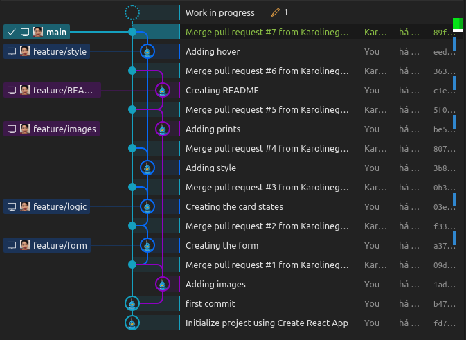
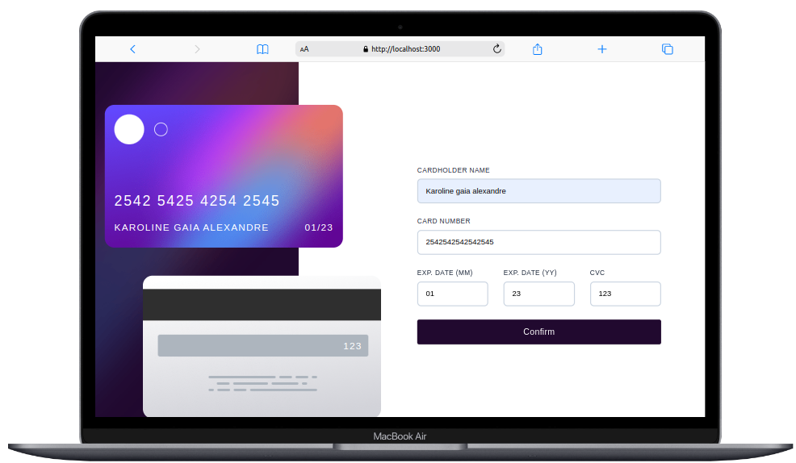
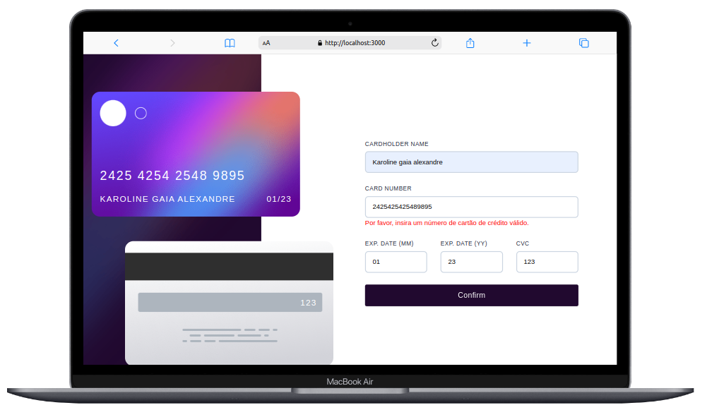
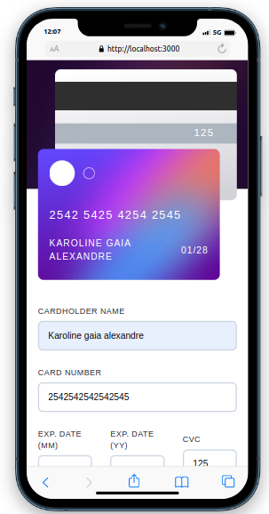

<a id='ancora'></a>
# Interactive Card Form

<br>
This is a challenge by FrontEnd Mentor for MTD.

<br>

[Link da Desafio](https://www.frontendmentor.io/challenges/interactive-card-details-form-XpS8cKZDWw/hub)


<br><br>

- [Sobre a Agência Método](#ancora1) <br>
- [Sobre o Desafio](#ancora2) <br>
- [Sobre o Projeto](#ancora3) <br>
- [Requisitos Obrigatórios](#ancora4) <br>
- [Competências Desenvolvidas](#ancora5) <br>
- [Execução](#ancora6) <br>
- [Desenvolvedora](#ancora7)

<br><br>

<a id="ancora1"></a>

## Sobre a Agência Método

<br>

<p align="center">
  
</p>

<br>

A Método é uma agência especializada em projetar, implantar e acelerar e-commerces. Somos uma das melhores agências de comércio eletrônico do país, referência em projetos realizados para os mais variados segmentos de mercado, seja B2C ou B2B.

<br>

<a id="ancora2"></a>

## Sobre o Desafio

<br>

Nesse desafio trabalharemos no desenvolvimento de uma página em React para utilizar os dados do projeto FrontEnd Mentor, que é um site de desafios aberto para criação de páginas FrontEnd.
O projeto tem como objetivo criar um formulário com validações de cartão.
<br>

Neste projeto você terá uma visão sobre como criar formulários e validações dos dados informados.

<br>

<a id="ancora3"></a>
## Sobre o Projeto

<br>

O projeto foi montado seguindo as boas práticas de Code Review, registrando toda e qualquer entrada de informação via Pull Requests, o que facilitaria a montagem de pipelines de teste de código e/ou gestão de conflitos de branchs, conforme árvore de commits:

<p align="center">
  
</p>

<br>

Para este projeto foram utilizadas as seguintes tecnologias:

<br>

* 

* 

* 

* 

* 


<br>

<a id="ancora4"></a>
## Requisitos Obrigatórios

<br>

### Requisito 1
* Preencher o formulário e verem os dados no cartão se atualizarem em tempo real

<p align="center">
  
</p>

<br>

### Requisito 2
* Receber mensagens de erro quando o formulário for enviado, em caso de:
    - Algum campo esteja vazio;
    - O número do cartão, data de vencimento ou CVC estão em um formato incorreto.

    <p align="center">
    
    </p>

### Requisito 3
* Verem o layout ideal de acordo com o aparelho e tamanho de tela que estejam utilizando.
 <p align="center">
    
    </p>
     <p align="center">
    
    </p>

<br>

<br>

<a id="ancora5"></a>
### 
## Competências Desenvolvidas

<br>

* Git Flow para controle e versionamento do código;
* Mobile First;
* Uso de framework para organização do código;
* Algorítmo de Luhn para validação de cartão de     crédito.
 

<br>

<a id="ancora6"></a>
## Execução 

<br>

1. Clone este repositório remoto em seu equipamento:
```
git clone git@github.com:Karolinegaia/interactive-card-details.git
```

2. Acesse a pasta do projeto:
````
cd interactive-card-details
````

3. Abra o VSCode ou IDE de sua preferência:
````
code .
````

4. Instale as dependências registradas no package.json:
````
npm install
````

5. Inicialize o React App:
````
npm start
````

<br>

<a id="ancora7"></a>
## Desenvolvedora

Projeto desenvolvido por:

<table align="center">
  <tr>
    <td align="center">
      <a target="_blank" href="https://www.linkedin.com/in/karoline-gaia-alexandre/">
        <br>
        <sub>
          <b>Karoline Gaia Alexandre</b>
           <p>Front-End</p>
        </sub>
      </a>
    </td>
  </tr>
</table>

<br><br>

[Voltar ao Topo](#ancora)